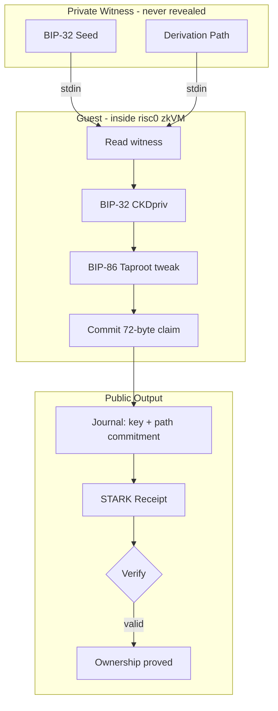

# bip32-pq-zkp

`bip32-pq-zkp` is a proof-of-concept for Bitcoin's post-quantum migration
path. If a quantum computer eventually breaks the secp256k1 key-spend path,
a soft fork could disable raw Schnorr/ECDSA spends and require a
zero-knowledge proof of BIP-32 seed knowledge instead. This repo demonstrates
that proof: given a Taproot output key on-chain, the owner proves, inside a
STARK-based zkVM, that they know the BIP-32 seed and derivation path that
produced it, without ever revealing the seed.

The proof relation:

$$
\mathcal{R} = \left\lbrace
\begin{array}{l}
  (\underbrace{K, C}_{\text{public}}\ ;\ \underbrace{s, \mathbf{p}}_{\text{witness}}) :\\[6pt]
  K = \textsf{BIP86Taproot}\!\left(\textsf{BIP32Derive}(s,\, \mathbf{p})\right) \\[4pt]
  C = \textsf{SHA256}\!\left(\texttt{"bip32-pq-zkp:path:v1"}\ \|\ \mathbf{p}\right)
\end{array}
\right\rbrace
$$

where $K$ is the Taproot output key, $C$ is the path commitment, $s$ is the
BIP-32 seed, and $\mathbf{p}$ is the derivation path.

## Background

The idea comes from Sattath and Wyborski's paper ["Protecting Quantum
Procrastinators with Signature
Lifting"](https://eprint.iacr.org/2023/362). Their key insight is that
BIP-32 HD derivation passes through HMAC-SHA512, a post-quantum one-way
function, so the seed-to-key path has structure that survives a quantum
break of the elliptic curve. They call this **seed lifting** and show it
can recover HD-derived coins even after the child public key leaks.

Their concrete construction uses Picnic signatures, which requires
**revealing the master secret key** to the verifier. They explicitly leave
the harder variant, seed lifting *without* exposing the master secret,
as an open problem.

This repo solves that open problem. Instead of Picnic, we run the full
BIP-32 derivation inside a risc0 zkVM guest and produce a STARK proof. The
seed and derivation path are private witness data that never leave the
prover. The STARK proof system is itself post-quantum secure (transparent,
no trusted setup), so the entire construction holds even in a world with
large-scale quantum computers.

### Future Work

The current proof binds the seed to a Taproot output key but does not bind
the proof to a specific spending transaction. A production deployment would
need to commit to the transaction sighash inside the proof so that the
receipt cannot be replayed to authorize a different spend. That is the
natural next step toward a consensus-ready migration rule.

The private witness is:

- the seed
- the derivation path

The public claim is:

- the final 32-byte Taproot output key
- a 32-byte commitment to the private derivation path
- claim version and policy flags

The canonical verifier artifact set is:

- a binary receipt file
- a human-readable `claim.json` file

The intended verifier flow is:

1. load the receipt
2. load `claim.json`
3. compute or pin the expected image ID for the exact guest artifact
4. verify the receipt against that image ID
5. compare the verified public journal output to `claim.json`

Direct `PUBKEY`, `PATH_COMMITMENT`, or `BIP32_PATH` checks are still
supported, but they are the advanced/manual path rather than the default
verifier UX.

## How It Works

1. The host builds a private witness containing the BIP-32 seed and derivation
   path.
2. The host passes the witness to the guest program via stdin.
3. The guest runs the full BIP-32 key derivation and BIP-86 Taproot output-key
   computation inside the risc0 zkVM.
4. The guest commits a 72-byte public claim (version, flags, output key, path
   commitment) to the proof journal.
5. The host generates a STARK proof and writes the receipt and claim artifacts.



## What This Repo Contains

This repo is the demo layer on top of the reusable sibling `go-zkvm` host and
guest plumbing.

It contains:

- minimal BIP-32 derivation helpers
- BIP-86 Taproot output-key derivation helpers
- the TinyGo guest for the final proof claim
- the demo-specific Go host command for `execute`, `prove`, and `verify`
- host-side reference tests against `btcd/txscript`
- claim and runbook documentation
- the root-level `bip32pqzkp` Go package providing `Runner`,
  `BuildWitnessStdin`, `DecodePublicClaim`, and claim-file helpers

The reusable guest packaging, proving, and verification boundary lives in the
sibling `go-zkvm` repo.

## Expected Sibling Layout

```text
github.com/roasbeef/
├── risc0
├── tinygo-zkvm
├── go-zkvm
└── bip32-pq-zkp
```

Fresh-clone setup that still matters in practice:

- in sibling `tinygo-zkvm`, run `git submodule update --init --recursive`
- in sibling `risc0`, run `git lfs pull`
- `make execute`, `make prove`, and `make verify` will build the sibling
  `go-zkvm` `host-ffi` shared library if it is missing or stale

If your default `go` is newer than the TinyGo lane supports, export:

```bash
export GO_GOROOT=/path/to/go1.24.4
```

## Quick Start

Build the deterministic platform archive from the sibling `risc0` repo:

```bash
make platform-standalone
```

Run the built-in test vector in execute-only mode:

```bash
make execute GO_GOROOT=/path/to/go1.24.4
```

Generate the canonical verifier artifacts:

```bash
make prove GO_GOROOT=/path/to/go1.24.4
```

Verify the emitted `receipt + claim.json` pair:

```bash
make verify GO_GOROOT=/path/to/go1.24.4
```

By default:

- `make execute` and `make prove` use the built-in BIP-32 test vector
- `make verify` uses the default artifacts from the prior `make prove`
- the documented demo lane keeps `require_bip86=true`

To use an explicit private witness instead of the built-in vector:

```bash
make prove GO_GOROOT=/path/to/go1.24.4 \
  PRIV_SEED_HEX=000102030405060708090a0b0c0d0e0f \
  BIP32_PATH="86',0',0',0,0" \
  REQUIRE_BIP86=1
```

## Artifacts

The default prove target writes:

- `./artifacts/bip32-test-vector.receipt`
- `./artifacts/bip32-test-vector.claim.json`

The receipt is the actual proof artifact. `claim.json` is the stable,
human-readable description of the public statement being proved.

## Current Verified Result

Current built-in vector result:

- Taproot output key:
  - `00324bf6fa47a8d70cb5519957dd54a02b385c0ead8e4f92f9f07f992b288ee6`
- path commitment:
  - `4c7de33d397de2c231e7c2a7f53e5b581ee3c20073ea79ee4afaab56de11f74b`
- public claim journal size:
  - `72` bytes
- latest measured proof seal size on this Mac:
  - `1797880` bytes
- current deterministic image ID:
  - `b823d67c3ec46ce8434369dcce609fae92dd0c826ec2781ff7cccb6d91793d23`
- latest clean-room prove time from published repos:
  - `54.28s`

On Apple Silicon, the local proving lane was validated with Metal enabled.
Guest compilation is still normal CPU work; Metal applies to the local prover,
not to TinyGo compilation.

## Policy

The documented demo lane defaults to BIP-86 enforcement, but callers can opt
out explicitly for non-BIP-86 derivations.

The current design intentionally keeps this as a single guest image:

- the BIP-86 requirement is carried as a verifier-visible public claim flag
- opting out changes the public policy bit, not the image model

## Layout

- `bip32/`
  - minimal derivation helpers used by the guest and host-side tests
- `guest/`
  - TinyGo guest for the proof claim
- `cmd/bip32-pq-zkp-host/`
  - thin demo-specific Go CLI for `execute`, `prove`, and `verify`
- `hostcheck/`
  - host-side correctness tests against `btcd/txscript`
- `docs/`
  - claim statement, runbook, and code-format notes

## Documentation

Start with:

- `docs/README.md`
- `docs/claim.md`
- `docs/running.md`

The top-level `progress.md` remains the repo-local working log for the demo and
its major findings.
