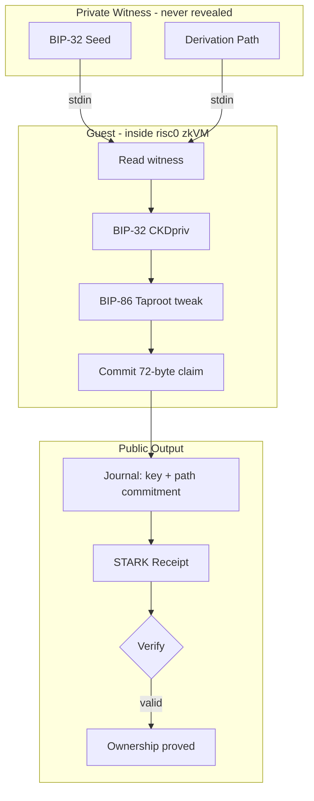

# bip32-pq-zkp

`bip32-pq-zkp` is a proof-of-concept for Bitcoin's post-quantum migration
path. If a quantum computer eventually breaks the secp256k1 key-spend path,
a soft fork could disable raw Schnorr/ECDSA spends and require a
zero-knowledge proof of BIP-32 seed knowledge instead. This repo demonstrates
that proof: given a Taproot output key on-chain, the owner proves, inside a
STARK-based zkVM, that they know the BIP-32 seed and derivation path that
produced it, without ever revealing the seed.

The proof relation:

```math
\mathcal{R} = \left\lbrace\;
(\overbrace{K,\, C}^{\textsf{public}} ;\; \underbrace{s,\, \mathbf{p}}_{\textsf{witness}})
\;\middle|\;
\begin{aligned}
  K &= \textsf{BIP86Taproot}\bigl(\textsf{BIP32Derive}(s,\, \mathbf{p})\bigr) \\
  C &= \textsf{SHA256}\bigl(\texttt{"bip32-pq-zkp:path:v1"} \;\|\; \mathbf{p}\bigr)
\end{aligned}
\;\right\rbrace
```

where $K$ is the Taproot output key, $C$ is the path commitment, $s$ is the
BIP-32 seed, and $\mathbf{p}$ is the derivation path.

## Background

The idea comes from Sattath and Wyborski's paper ["Protecting Quantum
Procrastinators with Signature
Lifting"](https://eprint.iacr.org/2023/362). Their key insight is that
BIP-32 HD derivation passes through HMAC-SHA512, a post-quantum one-way
function, so the seed-to-key path has structure that survives a quantum
break of the elliptic curve. They call this **seed lifting** and show it
can recover HD-derived coins even after the child public key leaks.

Their concrete construction uses Picnic signatures, which requires
**revealing the master secret key** to the verifier. They explicitly leave
the harder variant, seed lifting *without* exposing the master secret,
as an open problem.

This repo solves that open problem. Instead of Picnic, we run the full
BIP-32 derivation inside a risc0 zkVM guest and produce a STARK proof. The
seed and derivation path are private witness data that never leave the
prover. The STARK proof system is itself post-quantum secure (transparent,
no trusted setup), so the entire construction holds even in a world with
large-scale quantum computers.

## How It Works

1. The host builds a private witness containing the BIP-32 seed and
   derivation path.
2. The host passes the witness to the guest program via stdin.
3. The guest runs the full BIP-32 key derivation and BIP-86 Taproot
   output-key computation inside the risc0 zkVM.
4. The guest commits a 72-byte public claim (version, flags, output key,
   path commitment) to the proof journal.
5. The host generates a STARK proof and writes the receipt and claim
   artifacts.



## Verifier Artifacts

A prove run emits two files: a binary receipt (the STARK proof) and a
human-readable `claim.json` that names the public fields from the relation
above. The intended verification flow is:

1. Load the receipt and `claim.json`.
2. Compute or pin the expected image ID for the guest binary.
3. Verify the receipt against that image ID.
4. Compare the verified journal output to the claim file.

Direct `PUBKEY`, `PATH_COMMITMENT`, or `BIP32_PATH` flag checks are also
supported for callers who want per-field verification without a claim file.

## What This Repo Contains

This repo is the demo layer on top of the reusable sibling `go-zkvm` host
and guest plumbing. It contains:

- minimal BIP-32 derivation helpers (`bip32/`)
- BIP-86 Taproot output-key derivation helpers
- the TinyGo guest that produces the proof claim (`guest/`)
- a demo-specific Go host CLI for `execute`, `prove`, and `verify`
  (`cmd/bip32-pq-zkp-host/`)
- host-side reference tests against `btcd/txscript` (`hostcheck/`)
- the root-level `bip32pqzkp` Go package providing `Runner`,
  `BuildWitnessStdin`, `DecodePublicClaim`, and claim-file helpers
- claim specification and runbook documentation (`docs/`)

The reusable guest packaging, proving, and verification boundary lives in
the sibling [`go-zkvm`](https://github.com/roasbeef/go-zkvm) repo.

## Expected Sibling Layout

```text
github.com/roasbeef/
├── risc0
├── tinygo-zkvm
├── go-zkvm
└── bip32-pq-zkp
```

Fresh-clone setup:

- in sibling `tinygo-zkvm`, run `git submodule update --init --recursive`
- in sibling `risc0`, run `git lfs pull`
- `make execute`, `make prove`, and `make verify` will build the sibling
  `go-zkvm` `host-ffi` shared library if it is missing or stale

If your default `go` is newer than the TinyGo lane supports, export:

```bash
export GO_GOROOT=/path/to/go1.24.4
```

## Quick Start

Build the deterministic platform archive from the sibling `risc0` repo:

```bash
make platform-standalone
```

Run the built-in test vector in execute-only mode:

```bash
make execute GO_GOROOT=/path/to/go1.24.4
```

Generate the canonical verifier artifacts:

```bash
make prove GO_GOROOT=/path/to/go1.24.4
```

Verify the emitted receipt + claim pair:

```bash
make verify GO_GOROOT=/path/to/go1.24.4
```

By default:

- `make execute` and `make prove` use the built-in BIP-32 test vector
- `make verify` uses the default artifacts from the prior `make prove`
- the documented demo lane keeps `require_bip86=true`
- `make prove` defaults to `RECEIPT_KIND=composite`

To generate a smaller recursively compressed receipt instead:

```bash
make prove GO_GOROOT=/path/to/go1.24.4 RECEIPT_KIND=succinct
```

To use an explicit private witness instead of the built-in vector:

```bash
make prove GO_GOROOT=/path/to/go1.24.4 \
  PRIV_SEED_HEX=000102030405060708090a0b0c0d0e0f \
  BIP32_PATH="86',0',0',0,0" \
  REQUIRE_BIP86=1
```

## Artifacts

The default prove target writes:

- `./artifacts/bip32-test-vector.receipt`
- `./artifacts/bip32-test-vector.claim.json`

The receipt is the STARK proof artifact. `claim.json` is the stable,
human-readable description of the public statement being proved.

## Current Verified Result

Built-in test vector result (BIP-32 test vector 1, path `m/86'/0'/0'/0/0`):

| Field | Value |
|-------|-------|
| Taproot output key | `00324bf6fa47a8d70cb5519957dd54a02b385c0ead8e4f92f9f07f992b288ee6` |
| Path commitment | `4c7de33d397de2c231e7c2a7f53e5b581ee3c20073ea79ee4afaab56de11f74b` |
| Journal size | 72 bytes |
| Image ID | `8a6a2c27dd54d8fa0f99a332b57cb105f88472d977c84bfac077cbe70907a690` |
| Composite proof seal size | 1,797,880 bytes |
| Composite receipt size on disk | 1,799,256 bytes |
| Composite prove time | 52.51s |
| Composite verify time | 0.15s |
| Succinct proof seal size | 222,668 bytes |
| Succinct receipt size on disk | 223,319 bytes |
| Succinct prove time | 170.93s |
| Succinct verify time | 0.04s |

On Apple Silicon, the local proving lane uses Metal GPU acceleration.
Guest compilation is normal CPU work; Metal applies to the prover only.

The public claim is identical in both receipt modes. Changing `RECEIPT_KIND`
only changes the receipt representation and proof size/time tradeoff, not the
claim semantics or image ID.

## Policy

The demo lane defaults to BIP-86 path enforcement, but callers can opt out
for non-BIP-86 derivations. The design keeps a single guest image: the
BIP-86 requirement is a verifier-visible public claim flag, not a separate
image identity.

## Future Work

The current proof binds the seed to a Taproot output key but does not yet
bind the proof to a specific spending transaction. A production deployment
would need to commit to the BIP-341 sighash digest inside the proof so that
the receipt cannot be replayed to authorize a different spend. That is the
natural next step toward a consensus-ready migration rule. See
`docs/claim.md` for a detailed v2 claim sketch.

## Documentation

- `docs/README.md`: reading order and topic map
- `docs/claim.md`: claim specification and v2 sketch
- `docs/running.md`: build, execute, prove, and verify commands
